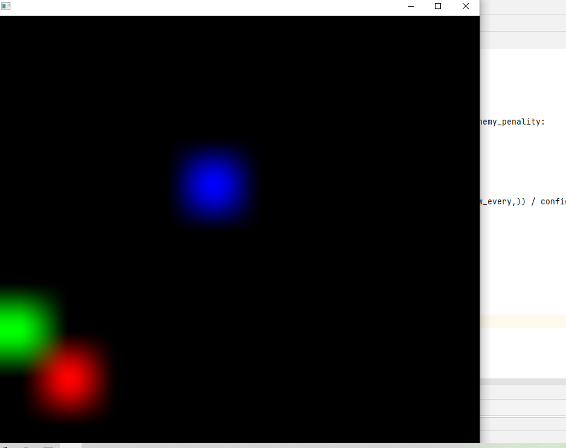

## 1、项目介绍
这是一个采用强化学习技术的捕食者游戏，角色通过学习来寻找吃到果实的路径。用于强化学习练习的项目。
This is a predator game that uses reinforcement learning techniques, where characters learn to find their way to the fruit. Items for intensive learning exercises.

## 2、具体流程

* 导入库
    *  matplotlib
    *  OpenCV
* 参数定义
* 创建Agent类
* 初始化环境
* 训练
* 输出
* 保存

## 3、问题反馈
在使用中遇到问题，欢迎反馈给我，可以用以下联系方式跟我交流

* 邮件: 2826389624@qq.com
## 4、结果展示

